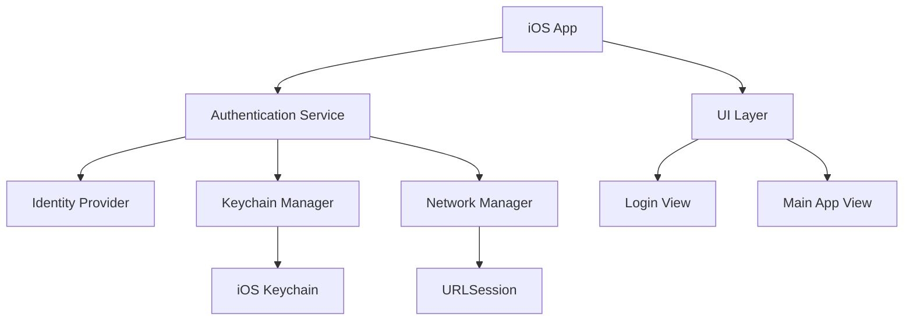

# Design Document

## Overview

The iOS Identity Provider Authentication app is a native iOS application built using Swift and UIKit/SwiftUI that provides secure authentication through configurable identity providers. The app implements OAuth 2.0 and OpenID Connect protocols to authenticate users against enterprise identity providers, with secure token storage and session management.

The application follows the Model-View-ViewModel (MVVM) architectural pattern and leverages iOS security frameworks including Keychain Services and Local Authentication for secure credential and token management.

## Architecture

### High-Level Architecture



### Component Layers

1. **Presentation Layer**: SwiftUI/UIKit views and ViewModels
2. **Business Logic Layer**: Authentication services and managers
3. **Data Layer**: Keychain storage and network communication
4. **Security Layer**: iOS Keychain Services and Local Authentication

## Components and Interfaces

### 1. Authentication Manager

**Purpose**: Central coordinator for all authentication operations

**Key Responsibilities**:
- Orchestrate OAuth 2.0/OpenID Connect flows
- Manage authentication state
- Handle token refresh logic
- Coordinate with keychain storage

**Interface**:
```swift
protocol AuthenticationManagerProtocol {
    func authenticate(username: String, password: String) async throws -> AuthenticationResult
    func refreshTokenIfNeeded() async throws -> Bool
    func logout() async
    func isAuthenticated() -> Bool
    var authenticationState: AuthenticationState { get }
}
```

### 2. Identity Provider Service

**Purpose**: Handle communication with various identity providers

**Key Responsibilities**:
- Execute OAuth 2.0 Resource Owner Password Credentials flow
- Support OpenID Connect authentication
- Handle provider-specific configurations
- Parse and validate tokens

**Interface**:
```swift
protocol IdentityProviderServiceProtocol {
    func authenticate(credentials: Credentials, provider: IdentityProvider) async throws -> TokenResponse
    func refreshToken(_ refreshToken: String, provider: IdentityProvider) async throws -> TokenResponse
    func validateConfiguration(_ provider: IdentityProvider) throws
}
```

### 3. Keychain Manager

**Purpose**: Secure storage and retrieval of authentication tokens

**Key Responsibilities**:
- Store access tokens, refresh tokens, and user data
- Implement appropriate keychain access controls
- Handle keychain errors and edge cases
- Support biometric authentication for token access

**Interface**:
```swift
protocol KeychainManagerProtocol {
    func store(tokens: AuthTokens, for userID: String) throws
    func retrieveTokens(for userID: String) throws -> AuthTokens?
    func deleteTokens(for userID: String) throws
    func clearAllTokens() throws
}
```

### 4. Network Manager

**Purpose**: Handle all network communication with identity providers

**Key Responsibilities**:
- Execute HTTP requests with proper security headers
- Handle SSL certificate validation
- Implement request/response logging for debugging
- Manage network error handling

**Interface**:
```swift
protocol NetworkManagerProtocol {
    func performRequest<T: Codable>(_ request: NetworkRequest) async throws -> T
    func performTokenRequest(_ request: TokenRequest) async throws -> TokenResponse
}
```

### 5. Configuration Manager

**Purpose**: Manage identity provider configurations

**Key Responsibilities**:
- Load and validate identity provider settings
- Support multiple provider configurations
- Handle configuration updates
- Validate endpoint URLs and client credentials

**Interface**:
```swift
protocol ConfigurationManagerProtocol {
    func loadConfiguration() throws -> [IdentityProvider]
    func validateProvider(_ provider: IdentityProvider) throws
    func selectProvider(_ providerID: String) throws -> IdentityProvider
}
```

## Data Models

### Authentication Models

```swift
struct Credentials {
    let username: String
    let password: String
}

struct AuthTokens {
    let accessToken: String
    let refreshToken: String?
    let tokenType: String
    let expiresIn: TimeInterval
    let scope: String?
    let idToken: String? // For OpenID Connect
}

struct IdentityProvider {
    let id: String
    let name: String
    let tokenEndpoint: URL
    let authorizationEndpoint: URL?
    let clientID: String
    let clientSecret: String?
    let scopes: [String]
    let type: ProviderType
}

enum ProviderType {
    case oauth2
    case openIDConnect
}

enum AuthenticationState {
    case unauthenticated
    case authenticating
    case authenticated(user: User)
    case error(AuthenticationError)
}

struct User {
    let id: String
    let username: String
    let email: String?
    let displayName: String?
}
```

### Error Models

```swift
enum AuthenticationError: Error, LocalizedError {
    case invalidCredentials
    case networkError(underlying: Error)
    case serverError(statusCode: Int)
    case configurationError(String)
    case keychainError(OSStatus)
    case tokenExpired
    case biometricAuthenticationFailed
    
    var errorDescription: String? {
        // Localized error descriptions
    }
}
```

## Error Handling

### Error Categories

1. **Network Errors**: Connection timeouts, DNS failures, SSL errors
2. **Authentication Errors**: Invalid credentials, expired tokens, server rejections
3. **Configuration Errors**: Invalid provider settings, missing endpoints
4. **Security Errors**: Keychain access failures, biometric authentication failures
5. **Validation Errors**: Empty fields, malformed inputs

### Error Handling Strategy

- **User-Facing Errors**: Display localized, actionable error messages
- **Technical Errors**: Log detailed information for debugging while showing generic messages to users
- **Retry Logic**: Implement exponential backoff for network failures
- **Fallback Mechanisms**: Graceful degradation when optional features fail

### Error Recovery

```swift
// Example error recovery flow
func handleAuthenticationError(_ error: AuthenticationError) {
    switch error {
    case .tokenExpired:
        // Attempt token refresh
        Task { await refreshTokenIfNeeded() }
    case .networkError:
        // Show retry option
        showRetryDialog()
    case .invalidCredentials:
        // Clear stored credentials and return to login
        clearStoredCredentials()
        navigateToLogin()
    default:
        // Show generic error message
        showErrorAlert(error.localizedDescription)
    }
}
```

## Testing Strategy

### Unit Testing

**Authentication Manager Tests**:
- Test authentication flow with valid/invalid credentials
- Test token refresh logic
- Test logout functionality
- Test state management

**Keychain Manager Tests**:
- Test token storage and retrieval
- Test keychain error handling
- Test data deletion
- Mock keychain operations for testing

**Network Manager Tests**:
- Test HTTP request/response handling
- Test error scenarios (network failures, server errors)
- Mock network responses for testing
- Test SSL certificate validation

### Integration Testing

**End-to-End Authentication Flow**:
- Test complete login process from UI to token storage
- Test automatic token refresh
- Test logout and cleanup
- Test biometric authentication integration

**Identity Provider Integration**:
- Test OAuth 2.0 flow with test identity provider
- Test OpenID Connect flow
- Test multiple provider configurations
- Test provider failover scenarios

### UI Testing

**Login Screen Tests**:
- Test input validation
- Test loading states
- Test error message display
- Test navigation flows

**Accessibility Testing**:
- Test VoiceOver compatibility
- Test Dynamic Type support
- Test high contrast mode
- Test keyboard navigation

### Security Testing

**Token Security**:
- Verify tokens are stored in keychain with appropriate access controls
- Test token encryption at rest
- Verify tokens are not logged or exposed
- Test biometric authentication requirements

**Network Security**:
- Verify all communication uses HTTPS
- Test certificate pinning (if implemented)
- Verify sensitive data is not cached
- Test request/response security headers

### Performance Testing

**Authentication Performance**:
- Measure login response times
- Test token refresh performance
- Test keychain operation performance
- Test memory usage during authentication

**Network Performance**:
- Test authentication under poor network conditions
- Measure request timeout handling
- Test concurrent authentication attempts
- Test large token handling